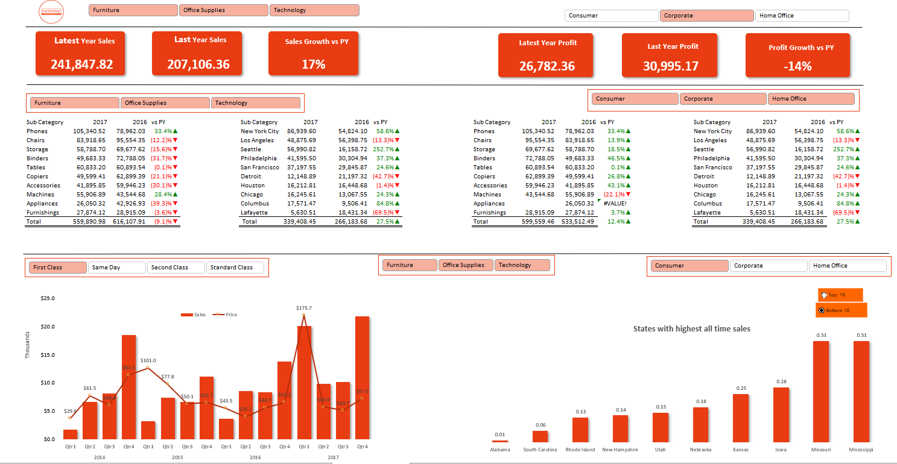

# Data Analysis Project

### This project uses Excel to analyze a dataset of sales data. The dataset contains information about the products sold, the customers who purchased them, and the date of sale.

The project includes the following steps:
1. Wireframing dashboard
2. Determination of required data points
3. Data cleaning
4. Data analysis
5. Data visualization & Dashboarding

## The dashboard contains the following visualizations:

The dashboard images are located in the `images` directory.
## Project Dashboard Image
---

---

## To run the project:

1. Open the `data_analysis_pivot_tables_power_query_dashboards.xlsx` file in Excel.
2. Click on the `Dashboard` tab.
3. The dashboard will appear.

## To learn more about the project:

* The `README.md` file contains a description of the project.
* The `Data Analysis Project.xlsx` file contains the data,wireframe, analysis with pivot table and dashboard sheets
* The `images` directory contains the dashboard images.

## Author

Seidu Mohammed <seidumohammed64@gmail.com>

## Date