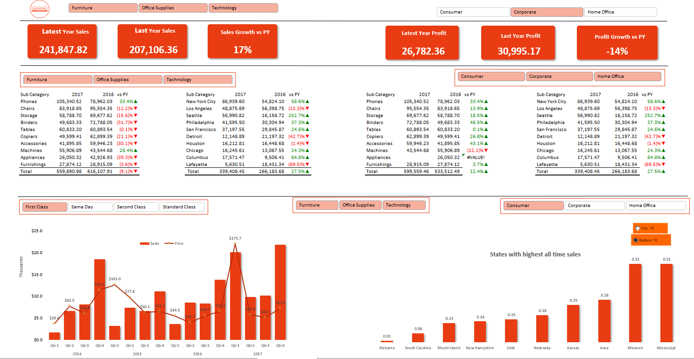
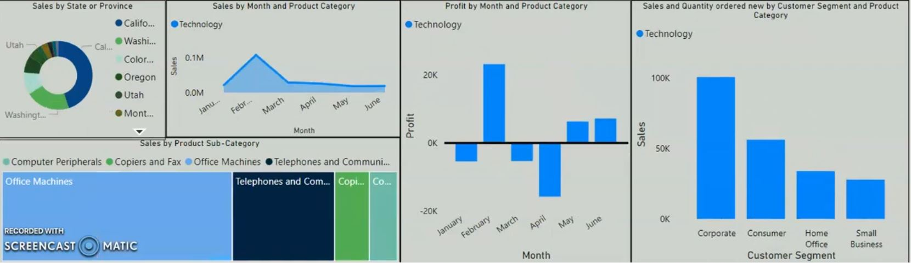
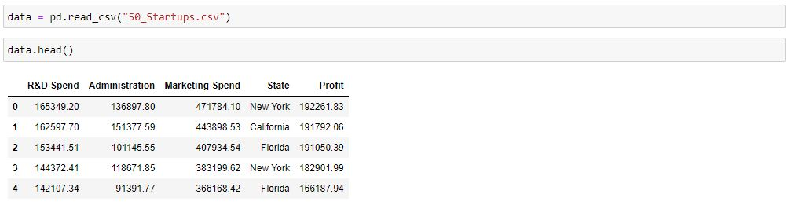
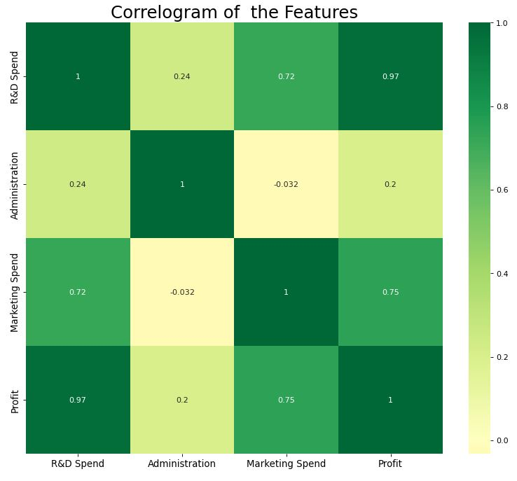

# Data Analysis Projects Snapshots

# 1. Sales Data Analysis With Excel Using Pivot Tables And Advanced Formulas

#### Project Description 

Project Link: [Repository Link](https://github.com/seidumohammed/data-analysis/tree/main/excel-dynamic-data-analysis_pivot_table)
---

---

# 2. Sales Data Analysis With Microsoft Power BI

#### Project Description

Project Link: [Repository Link](https://github.com/seidumohammed/data-analysis/tree/main/power_bi-dynami-data-analysis-dashboard)
---

---

---
---
# 3. Python, Machine Learning Data Analysis Project
#### Project Description
Simple Linear Regression model that seeks to advice investors on which growing startups to invest in
---
Project Link: [Repository Link](https://github.com/seidumohammed/data-analysis/tree/main/python_startups_investment_advisor_model)
---

---

---

---

# 4. Accident Data Analysis With Excel, Power BI and SQL 
#### Project Description
Pushing to github soon
---
[Completed Project Dashboard](sales-data-excel.soon)
---

# 5. Child Labour Data  Analysis with Python
#### Project Description
Pushing to github soon
---
[Completed Project Dashboard](sales-data-excel.soon)
---

# 6. Cricket Data Analysis Pythob, Pandas, Power BI

### Project Description
Pushing to github soon
---
[Completed Project Dashboard](sales-data-excel.soon)
---

# 7. Product Recommendation Analysis with Python

#### Project Description
Pushing to github soon
---
[Completed Project Dashboard](sales-data-excel.soon)
---