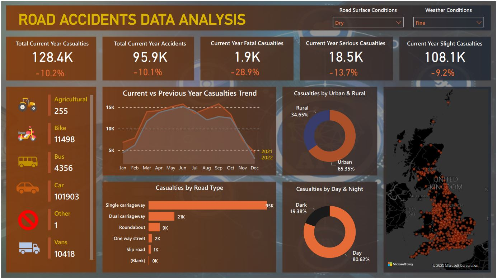

# PowerBI Data Analysis Project - Accidents Data

## Project steps:
1. Getting the requirement
2. Stakeholders 
3. Raw Data Overview
4. Connecting Data with Power BI
5. Data cleaning
6. Data Processing
7. Data Modeling,
8. Background Design in Power Point
9. Visualizationn/ Chart Design
10. Report/Dashboard Building
11. Extracting Insights
.
---
## Requirements
   Client wants to create dashboard for road aciddents from 2021 - 2022 
1. Primary KPI - total casualties & total accident values for latest year and YoY growth
2. Primary KPI's - total casualties by accident severity for latest year and YoY growth
3. Secondary KPI's -  Total casualties with respect to type of vehicle for latest year
4. Monthly trend shwoing comparison of casualties for latest year and previous year
5. Casualties by road type for latest year
6. Latest year road casualties by location and time(day/night)
7. Total casualties and total accident by location
.
---

## Stakeholders 
##### transport ministry, road transport department, general public,transport operators,
##### emergency_service_department,media,traffic management agencies.
.
---

---
## Author
Seidu Mohammed <seidumohammed64@gmail.com>
---
## Date : 11/07/2023
