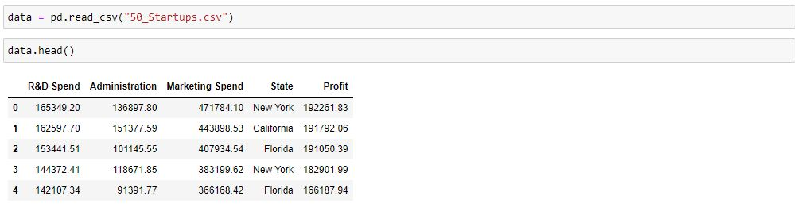
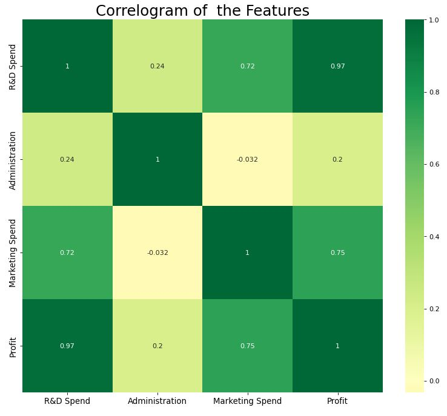

# Python, Machine Learning Data Analysis Project

### A Simple Linear Regression model that seeks to advice investors on which growing startups to invest in

The project includes the following steps:
1. Determination of required data points
2. Data cleaning
3. Data analysis
4. Data visualization & Dashboarding

## The dashboard contains the following visualizations:
--
---

---

---

---
The dashboard images are located in the `images` directory.
--- 
## Author

Seidu Mohammed <seidumohammed64@gmail.com>

## Date 
-
--- 
../../2020
---

